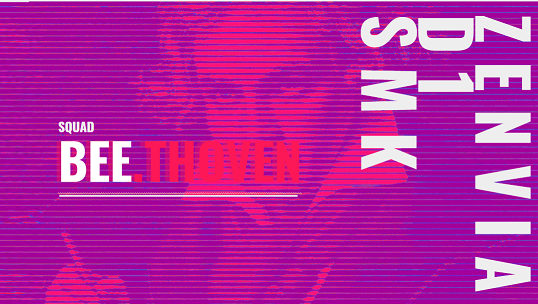
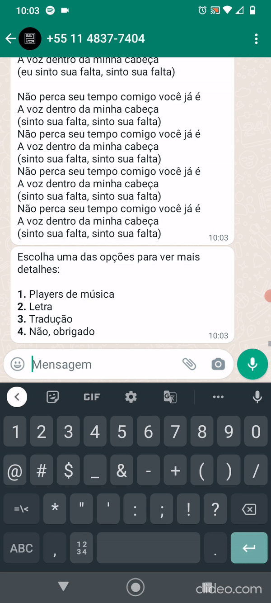
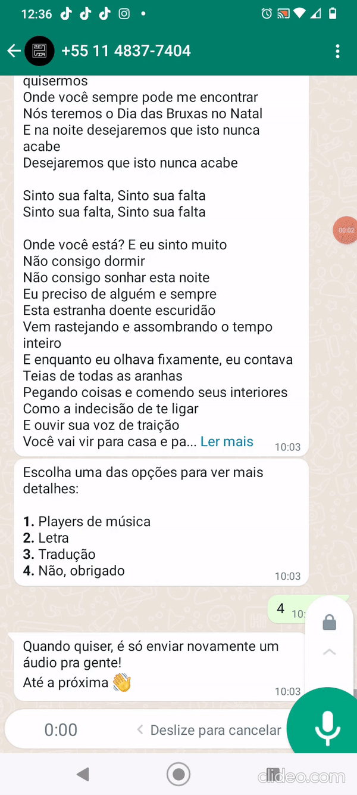

<h1 align="center">
    
</h1>

<h4 align="center">
	🐝 Bee.Thoven 🎶
</h4>

## 💻 Sobre o projeto

Projeto criado a partir de um desafio proposto pela chapter leader Stiphanie Silva, com o objetivo de executar o chatbot de música para whatsapp da plataforma Zenvia disponível neste <a href="https://www.zenvia.com/blog/developers/whatsapp-bot-nodejs/">tutorial</a> e aplicar novas features. 
<br/><br/>

## 🛠 Tecnologias

As seguintes ferramentas foram usadas:

- JavaScript
- Node.js
- Ngrok
- Zenvia SDK
<br/><br/>

## 🆕 Features

As features desenvolvidas foram:

- Players de Música
- Letra
- Tradução
- Menu de opções
- [beta] Encontrar a música a partir de um trecho gravado pela voz do usuário.
<br/><br/>

## ✅ API's utilizadas

- AudD
- Vagalume
- Song Link
- IBM speech-to-text 
- Google Custom Search JSON API
<br/><br/>

## 🎉 Exemplo de funcionamento

- No início da conversa é possível mandar uma mensagem ou diretamente o áudio a ser pesquisado, se a música foi encontrada, será retornado o nome do artísta, da música e do álbum, a foto do álbum, e 30 segundos de áudio da música. Essas funções fazem parte da feature original do bot de música Zenvia.  


- Após é apresentado um menu de opções onde é possível selecionar as features que foram implementadas nesse projeto. A opção 1 retorna uma lista com os links que levam diretamente ao player selecionado.


- A opção 2 retorna a letra da música, caso não encontre é informado que não foi possível encontrar e então apresenta o menu principal novamente.


- A opção 3 retorna a tradução da música, caso não encontre também informa que não foi possível encontrar e então apresenta o menu principal novamente.


- A opção 4 encerra o atendimento e é possível enviar outro áudio.




- .




## ⚠️ Pré-requisitos

Antes de começar, você vai precisar ter instalado em sua máquina as seguintes ferramentas:
[Git](https://git-scm.com), [Node.js](https://nodejs.org/en/).<br/>
Além disto é bom ter um editor para trabalhar com o código como [VSCode](https://code.visualstudio.com/)
<br/><br/>

## 📁 Estrutura de Pastas

```
.
├── assets                  # assets files
├── controllers             # code files
│   ├── logger              # logger controller
│   ├── menu                # menu controller
│   ├── message             # messages controller
│   ├── music               # music controller
│   │   └── features        # the implemented features
│   │       ├── infos       # music info feature
│   │       ├── lyrics      # lyrics feature
│   │       ├── players     # music players feature
│   │       ├── searches    # search for spoken music lyric
│   │       └── tradutions  # lyrics tradutions feature
│   ├── recognize           # voice, music and text option recognizers
│   └── webhook             # webhooker wrapper
│       └── client          # Zenvia client Webhook
└── ...
```
<br/><br/>

## 🚀 Como executar o projeto

1. Clone este repositório e instale as dependências com o comando <code> npm install </code>
2. Crie uma conta na plataforma <a href="https://ngrok.com/">Ngrok</a> 
3. Faça o download da ferramenta Ngrok - <a href="https://ngrok.com/download">download</a> e execute
4. Configure o token de autenticação gerado na plataforma Ngrok com o comando: <code>ngrok authtoken + "token"</code>
5. Rode o comando <code> ngrok http 3000</code> para criar o túnel na porta 3000
6. A ferramenta Ngrok está configurada, agora copie a URL pública gerada neste modelo: https://da3e845a1ceb.ngrok.io - Este túnel tem o prazo de 2h após esse tempo é preciso executar o ngrok novamente
7. Crie uma conta na plataforma <a href="https://app.zenvia.com">Zenvia</a> e siga o <a href="https://www.zenvia.com/blog/developers/whatsapp-bot-nodejs/">tutorial</a> a partir do passo 4.
8. Crie uma conta na plataforma <a href="https://audd.io/">AudD</a> e clique em Get an API Token
9. Faça o cadastro para obter o token da api Vagalume - <a href="https://api.vagalume.com.br/">link</a>
10. Obtenha o token da speech-to-text nesse <a href="https://cloud.ibm.com/catalog/services/speech-to-text">link</a>
11. Obtenha o token da api Custom Search JSON API neste <a href="https://developers.google.com/custom-search/v1/overview">link</a> 
12. Crie na raiz deste projeto o arquivo .env com os seguintes dados. Opcionalmente, você também pode modificar o arquivo env.example, alterar os tokens fictícios e renomeá-lo para .env:
  
```
  ZENVIA_TOKEN = "token"
  AUDD_TOKEN = "token"
  VAGALUME_TOKEN = "token"

  # Speech to Text
  STT_API_KEY = "token"
  STT_URL = "url"

  # Google Custom Search
  GCSKey = "token"
  GCSEngine = "token"
```

13. Por ultimo, no terminal deste repositório digite o comando "node ." 
Deverá receber a mensagem "Webhook is listening"

Pronto! O projeto está rodando ;)

